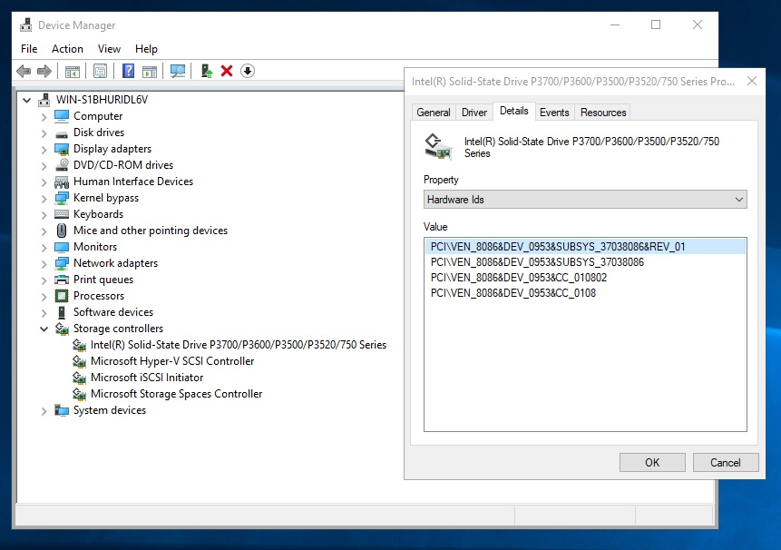
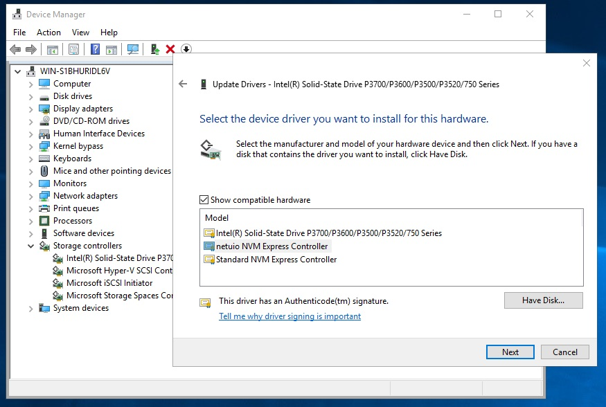
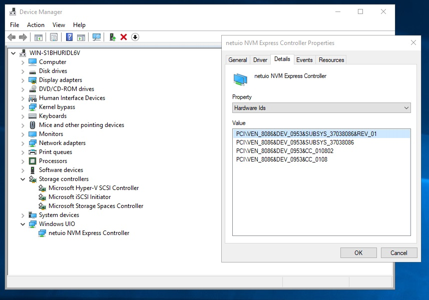
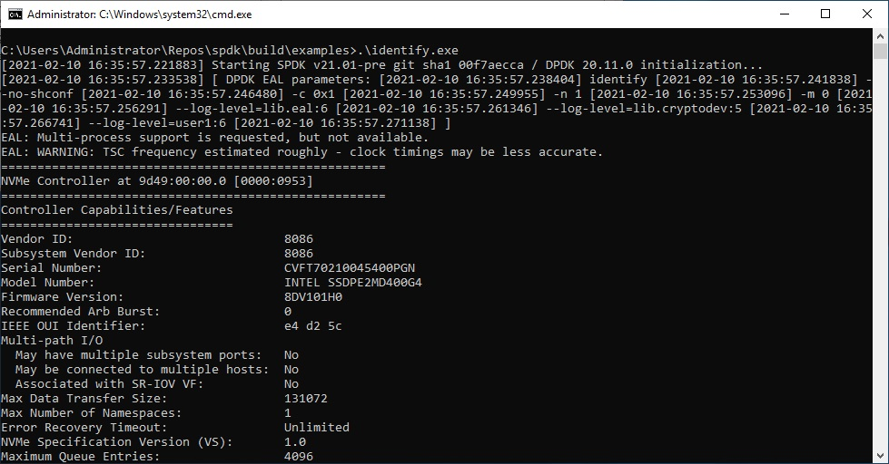

# Using a Physical NVMe Disk

A physical NVMe disk can be accessed directly by SPDK using the 'virt2phys' and 'netuio' drivers from the [dpdk-kmods](https://git.dpdk.org/dpdk-kmods/)
repository. This needs to be exclusive, rather than shared with the O/S.

See the README files in the [dpdk-kmods](https://git.dpdk.org/dpdk-kmods/) repository for build and installation instructions.

## Using a Hyper-V VM

When using a Hyper-V VM, the physical NVMe device must be passed through with Discrete Device Assignment rather than attaching it as a 'Physical hard disk'. Instructions on how to do this can be found in [Deploying Storage Devices Using DDA](https://docs.microsoft.com/en-us/windows-server/virtualization/hyper-v/deploy/deploying-storage-devices-using-dda).

Note that the NVMe controller should be passed through rather than the disk device.

The Location Path can be found by following the example in [Getting the Location Path Using Device Manager](https://docs.microsoft.com/en-us/windows-server/virtualization/hyper-v/plan/plan-for-deploying-devices-using-discrete-device-assignment#getting-the-location-path-by-using-device-manager).

## Installing the 'netuio' driver

Under Device Manager, select 'Storage controllers' and right click the device to be used. Note that this selects the NVMe controller, rather than the disk device itself.

Select 'Update driver', 'Browse my computer', 'Let me pick', 'Have Disk', Browse to 'netuio.inf' and select it. When you complete this process you will be prompted to reboot.

After rebooting, Device Manager will show 'Windows UIO' with associated 'netui NVM Express Controller'.

Run SPDK identify.exe (build\examples\identify.exe) to list the NVMe devices and their PCI addresses, which can then be passed to SPDK.

See [wpdk\test\iscsi\iscsi_nvme.json](https://github.com/wpdk/wpdk/blob/master/test/iscsi/iscsi_nvme.json) for an example configuration.
